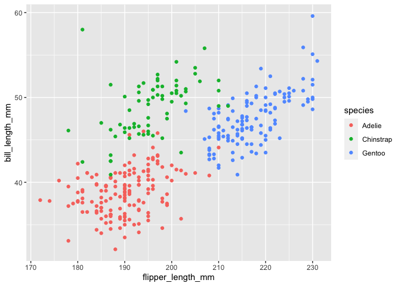

p8105_hw1_jt3387
================
2022-09-22

``` r
library(tibble)
library(tidyverse)
library(ggplot2)
```

## Problem 1

Load `penguins` dataset and clean up the column names.

``` r
data("penguins", package = "palmerpenguins")
penguins <- janitor::clean_names(penguins)
```

Description of the `penguins` dataset:

-   The names of the variables:
    *`species, island, bill_length_mm, bill_depth_mm, flipper_length_mm, body_mass_g, sex, year`*.
-   The values of important variables:
    *`species`*:`Adelie, Chinstrap, Gentoo`;
    *`island`*:`Biscoe, Dream, Torgersen`; *`sex`*:`female, male`;
    *`year`*:`2007, 2008, 2009`.
-   The size of the dataset: `344` rows and `8` columns.
-   The mean flipper length: `200.9152047` mm.

Make a scatterplot of `flipper_length_mm` (y) vs `bill_length_mm` (x).

``` r
ggplot(penguins, aes(y = bill_length_mm, x = flipper_length_mm, color = species)) + geom_point()
```

<!-- -->

Export the scatterplot to project directory.

``` r
ggsave("penguins_scatterplot.png")
```

## Problem 2

Create a data frame.

``` r
set.seed(777)
dataframe <-  tibble(
  vec_numeric <- rnorm(10),
  vec_logic <- c(vec_numeric > 0),
  vec_character <- c("a","b","c","d","e","f","g","h","i","j"),
  vec_factor <- factor(c("a", "a", "a", "b", "b", "b", "b", "c", "c", "c"))
)
```

Calculate the mean of each variable.

``` r
for (i in 1:4) {
 cat(mean(pull(dataframe, names(dataframe)[i])), "\n")
}
```

    ## 0.3189681 
    ## 0.6 
    ## NA 
    ## NA

The result shows that the numeric and logical variables’ mean can be
calculated, while the character and factor variables’ mean can’t be.

Apply the `as.numeric` function to convert variables from one type to
another.

``` r
for (i in 2:4) {
  cat(as.numeric(pull(dataframe, names(dataframe)[i])), "\n")
}
```

Result interpretation:

-   `TRUE` in the logical variable is converted to 1 and `FALSE` to 0,
    character variable is converted to a vector consist of `NA`, and
    factor variable is converted to number 1, 2, 3 which represents
    three levels.

-   The logical variable is boolean variable, and an integer value of 1
    or 0 is assigned depending on whether the variable value is true or
    not. Character variable can’t be converted to numeric coercively,
    and it will turn to `NA`. For the factor variable, `as.numeric` will
    return the underlying numeric (integer) representation, and the
    variable itself can’t be calculated.

-   In conclusion, the result helps explain what happens when we try to
    take the mean.
